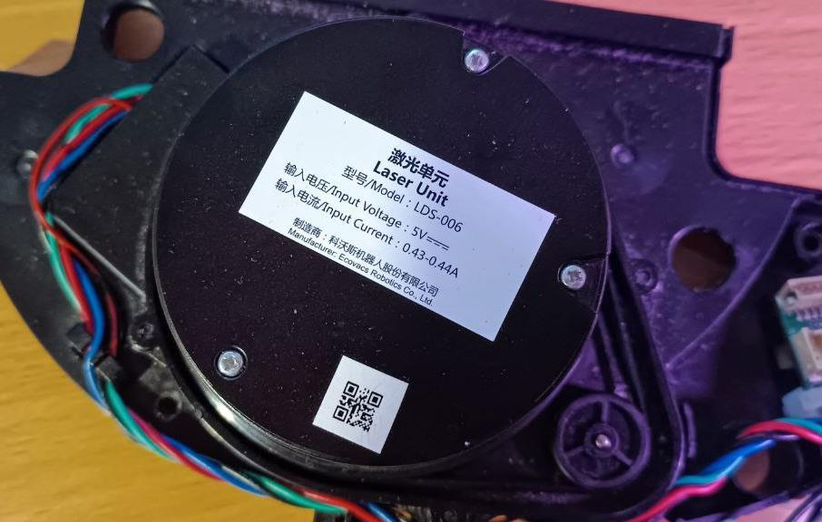
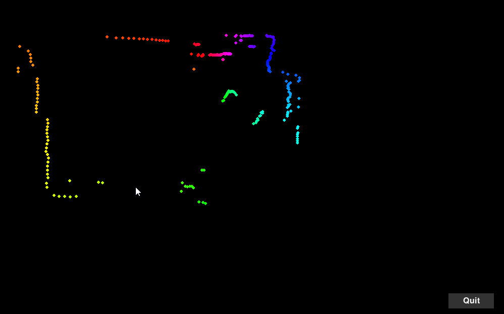

LDS-006 Laser Unit python handler
=======
## Reverse Engineered Python Class for LDS-006 Laser Unit Data

## Overview

This document describes a reverse-engineered Python class to read and parse data from the LDS-006
Laser Unit, typically installed in older Ecovacs robot vacuums. 
The LIDAR operates on a serial protocol with the following settings:

- **Baudrate**: 115200
- **Data Bits**: 8
- **Stop Bit**: 1
- **Parity**: None
- **Flow Control**: Xon/Xoff

## LIDAR Control Commands

- **Start LIDAR**: Send `$startlds$`
- **Stop LIDAR**: Send `$stoplds`
- **Typical Initialization Sequence**: `$stoplds$stoplds$startlds$`

## Data Transmission

- The LIDAR module sends data in bursts of **13.33ms** packets.
- Each packet contains **6 packs** of **22 bytes** each.

### Example Data

```
fa e2 4b 75 75 01 02 08 79 01 ba 07 7c 01 6d 07 84 01 ba 07 8e 06
fa e3 4b 75 89 01 57 07 88 88 00 00 88 88 00 00 9d 01 aa 06 f3 06
fa e4 4b 75 88 88 00 00 6e 01 8e 02 65 01 de 01 5f 01 f8 02 4c 07
fa e5 4b 75 5a 01 b3 05 58 01 f1 01 57 01 a7 02 54 01 2a 06 83 06
fa e6 4b 75 53 01 42 06 55 01 b2 03 56 01 de 03 88 88 00 00 8f 06
fa e7 4b 75 33 01 7a 16 63 01 bc 02 6f 01 ee 00 99 99 00 00 17 07
...
```

## Data Packet Structure

Each **22-byte pack** consists of:

1. **1 byte Header**: `0xFA`
2. **1 byte Index**: `0xA0` to `0xF9` (90 total indexes)
3. **2 bytes RPM Data**: RPM value multiplied by 100 (same for all 6 packs in a packet)
4. **16 bytes of Data**: 4 pairs of 4-byte data (2 bytes distance + 2 bytes correction/error)
5. **2 bytes CRC Sum**

### 16-Byte Data Breakdown

- **4 Points**, each with:
  - **2 bytes Distance**
  - **2 bytes Correction/Error**
- **Correction/Error Values**:
  - Inconsistent and jittery.
  - Depend on distance but purpose unclear.

## LIDAR Specifications

- **Rotation Speed**: 5 revolutions per second (300 RPM).
  - Example: `0x754b` = 30027 (30027 / 100 = 300.27 RPM).
- **Time for One Revolution**: 200ms.
- **Packet Timing**:
  - Each packet takes 13.33ms.
  - 200ms / 13.33ms = **15 packets per revolution**.
- **Resolution**:
  - Each packet contains 6 packs, each with 4 points.
  - 15 packets \* 6 packs \* 4 points = **360 points per revolution**.
  - Resolution: **1 degree**.

## Data Handling Notes

- **None Values**:
  - The LIDAR may return `None` for points that are too far or too close.
  - Represented in the stream as: `0x7777`, `0x8888`, or `0x9999`.
  - Distances clipped at approximately **120mm**, resulting in `0x0000` (treated as `None`).
- **Handler Behavior**:
  - The handler may return `None` values due to the above conditions.

## Screenshot of lidar_visualization.py
